# DCDC_DOWN_Converter_4_ISHI-KAI_OpenMPW_TR10-1
ISHI-KAI_Multiple_Projects_OpenMPW_TR10-1 向けの降圧型DCDCコンバータ（12v->5V）です。

# Members 
- [lufe](https://github.com/1uf3/vco)
    - VCO担当
- [noritsuna](https://github.com/noritsuna/DCDC_DOWN_Converter_4_ISHI-KAI_OpenMPW_TR10-1)
    - 降圧部担当

## 内容
- 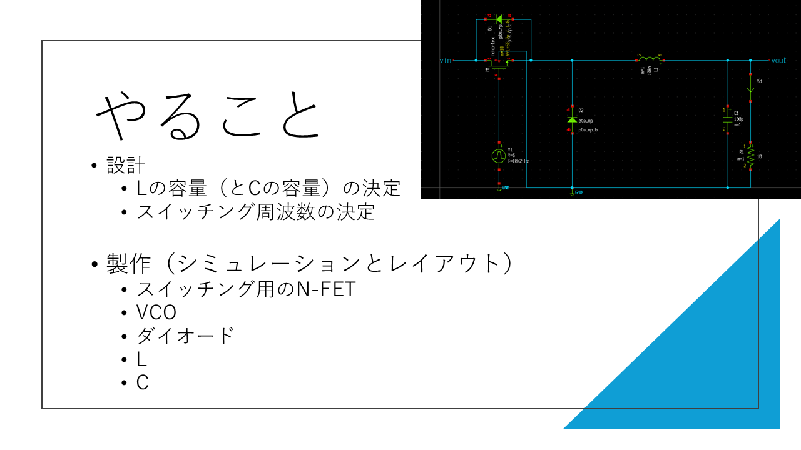
- 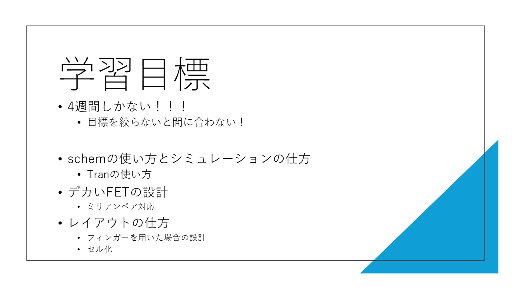
- 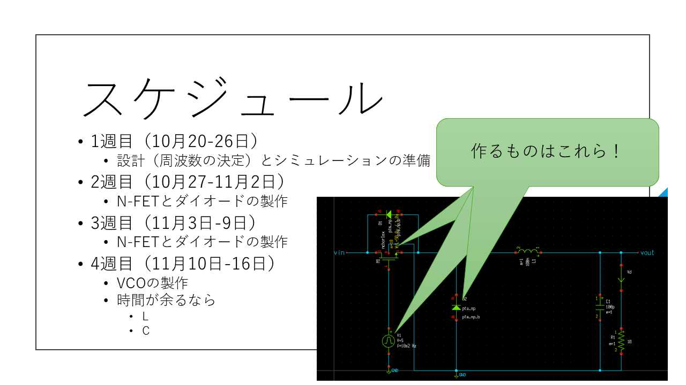

# 作成物

## vco
[lufe](https://github.com/1uf3/vco)担当

### xschem

#### inverter

#### buffer

#### vco

#### simulated vco hz

### klayout

## 降圧部
### xschem
- 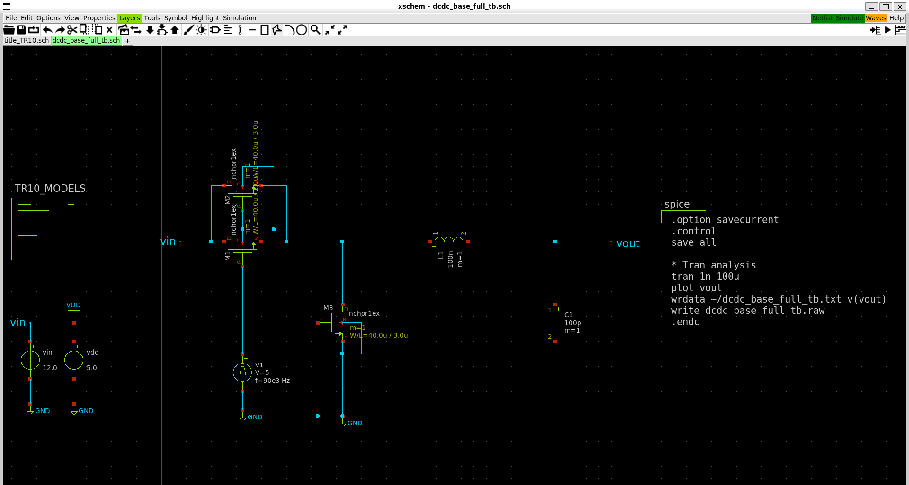

#### simulation
- 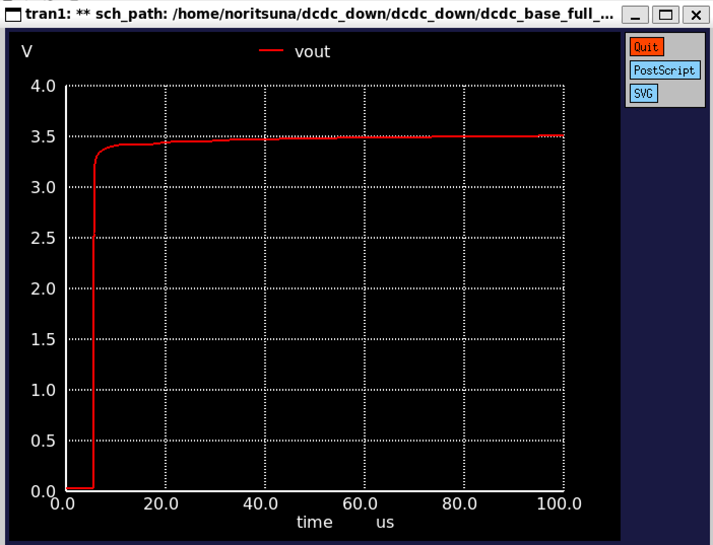
- 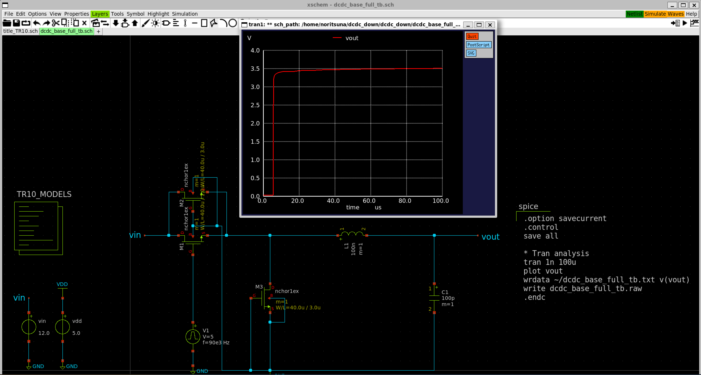

### klayout
- 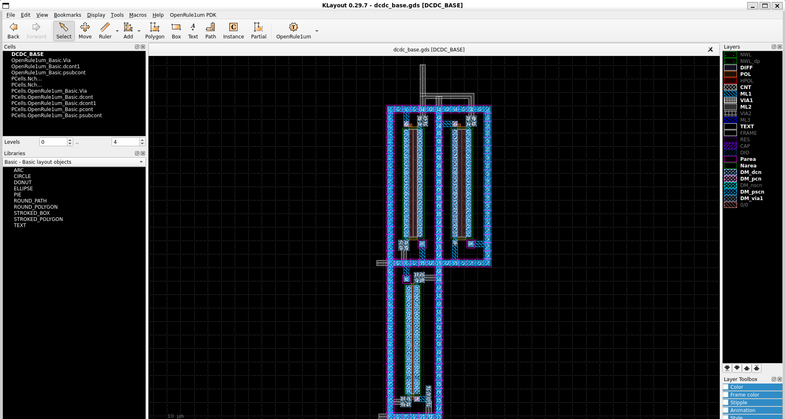

## 降圧型DCDCコンバータ
### xschem
- 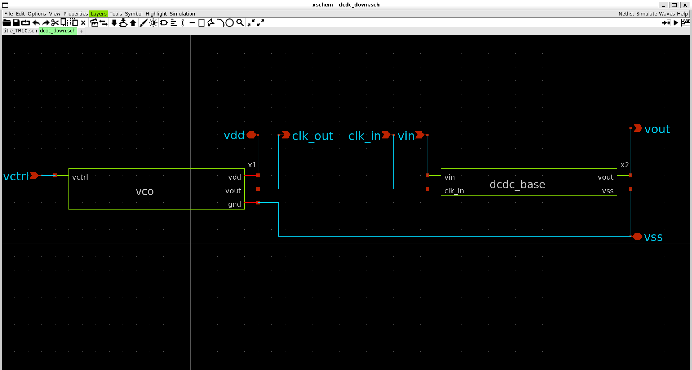

#### simulation
- 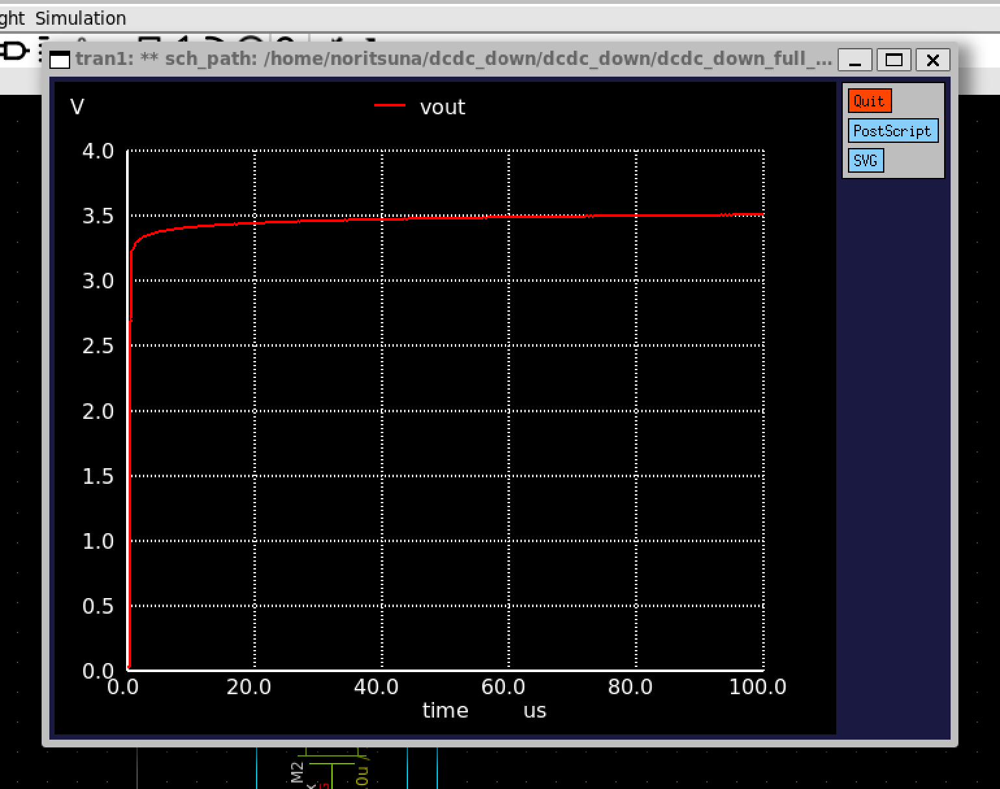
- 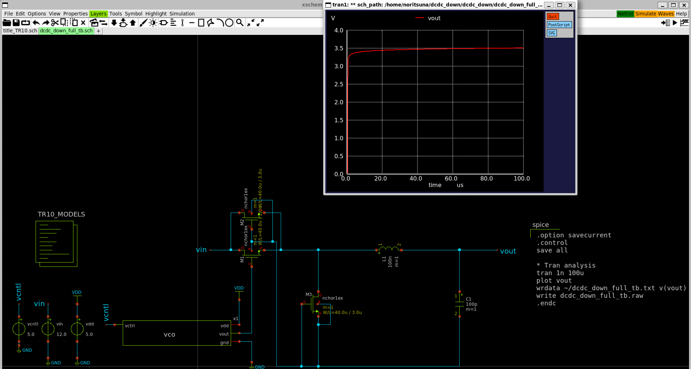

### klayout
- 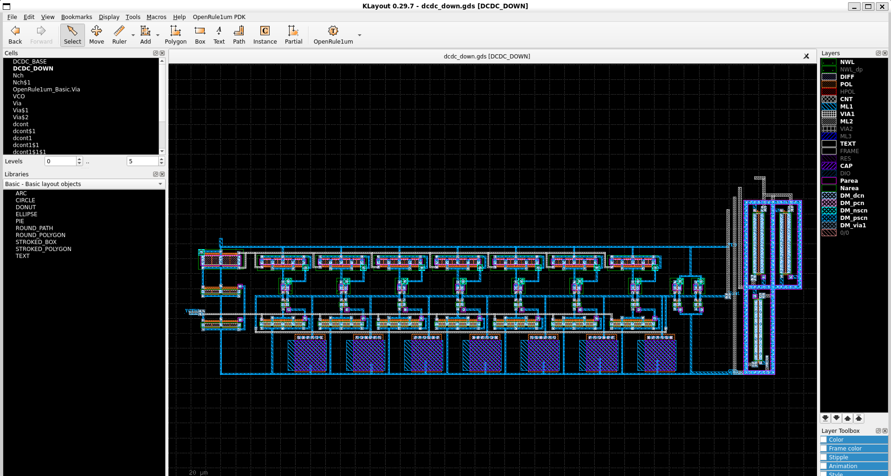

